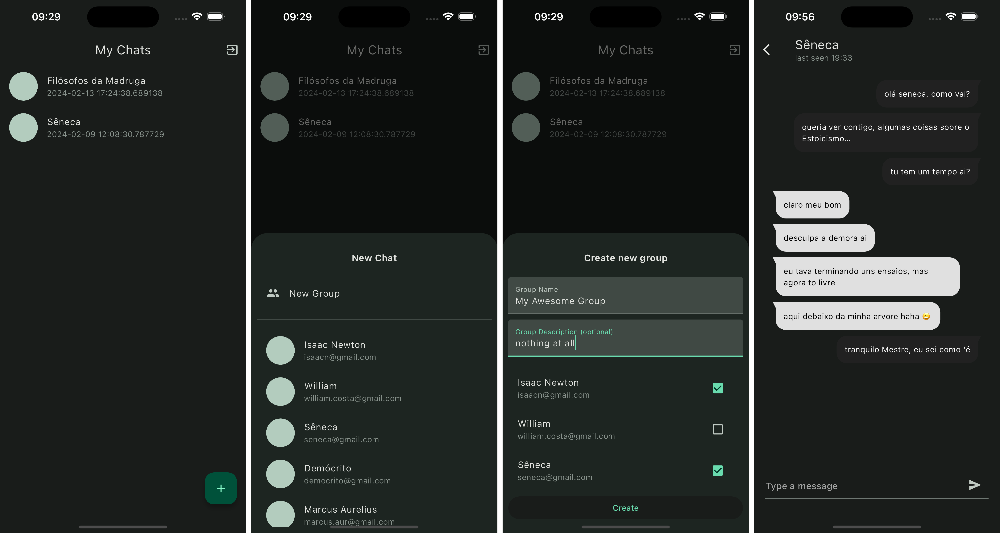

# @firebase_chat_app

This project uses Firebase Cloud Services to provide a structure for a
Chat application, which contains features such as Authentication, Private and Group
messaging as well a list of available contacts.

---

<br><br>

## Tech Stack

- Flutter (v3.16.3) and Dart (v3.2.3)
- Firebase Authentication
- Firestore DB
- Reactive Programming Paradigm with RxDart and dart streams
- Clean Architecture and SOLID principles
- Secure Storage for store user credentials
- Material Design 3

## Getting Started

1. Just clone this repository with:

```shell
git clone https://github.com/WillACosta/flutter_firebase_app
```

2. The next step is to setup this application with your own Firebase project

- Create a new project in Firebase Console
- Follow up the steps in the official [documentation here](https://firebase.google.com/docs/flutter/setup?platform=ios#configure-firebase)
- You won't need to add any additional plugins, they already exist in the project
- Just create a new project and run the command `flutterfire configure` as the documentation recommends

2. Run the following command on the root of the repository, to get dependencies

```shell
flutter pub get
```

- Remember that you'll need Flutter SDK installed before running this command.
  [Checkout here for the official documentation](https://docs.flutter.dev/get-started/install).

3. At last run the app with:

```shell
flutter run
```
